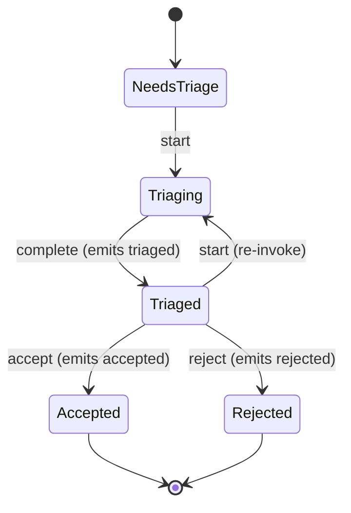

# Andy Issues

Issues management service

## Overview

Andy Issues is a microservice in the [Andy ecosystem](https://github.com/rivoli-ai) providing Issues management service.

### Features

- **REST API** - Full CRUD API with Swagger documentation
- **MCP Tools** - AI-assisted management via Model Context Protocol
- **gRPC** - High-performance RPC for service-to-service communication
- **Angular SPA** - Web-based management interface
- **CLI Tool** - Command-line resource management
- **OAuth2/OIDC** - Authentication via Andy Auth
- **RBAC** - Role-based access control via Andy RBAC
- **OpenTelemetry** - Distributed tracing, metrics, and logging

## Quick Start

```bash
# Start infrastructure
docker compose up -d postgres

# Run the API
cd src/Andy.Issues.Api
dotnet run

# Run the client (in a separate terminal)
cd client
npm install && npm start
```

## Architecture

| Layer | Project | Purpose |
|-------|---------|---------|
| Domain | `Andy.Issues.Domain` | Entities, enums |
| Application | `Andy.Issues.Application` | Interfaces, DTOs |
| Infrastructure | `Andy.Issues.Infrastructure` | EF Core, services |
| API | `Andy.Issues.Api` | REST, MCP, gRPC, auth |
| Shared | `Andy.Issues.Shared` | Shared types |
| CLI | `Andy.Issues.Cli` | Command-line tool |

## Triage Lifecycle

andy-issues owns the **triage** phase: the path a freshly filed issue takes from intake to a classified, accepted/rejected work item. The triage agent is defined in [`andy-agents`](https://github.com/rivoli-ai/andy-agents) and runs headless in [`andy-containers`](https://github.com/rivoli-ai/andy-containers); andy-issues owns the lifecycle, persistence, and event emission. See [ADR 0002](docs/adr/0002-triage-belongs-to-andy-issues.md) for the full rationale.



Terminal transitions append outbox rows that publish to NATS as `andy.issues.events.issue.<id>.{triaged,accepted,rejected}`. The same `IIssueService` is exposed through three surfaces:

| Surface | Where |
|---|---|
| REST | `/api/triage` — see [features.md](docs/features.md#triage-workflow) |
| MCP | tools `issue_get`, `issue_list`, `issue_triage` (via mcp-gateway) |
| CLI | `andy-issues-cli issues {list, get, triage}` — see [tools/Andy.Issues.Cli/README.md](tools/Andy.Issues.Cli/README.md) |

Cross-service handoffs:

- [`andy-tasks`](https://github.com/rivoli-ai/andy-tasks) subscribes to `andy.issues.events.issue.*.triaged` and creates a Goal from the payload (Epic AA). Never writes Issue state.
- [`andy-docs`](https://github.com/rivoli-ai/andy-docs) stores the input/output artifacts; andy-issues holds `DocsRef`s only (Z6/Z8).
- [`conductor`](https://github.com/rivoli-ai/conductor) renders the issue-detail UI and routes human edits back to andy-issues' REST surface (Epic AB).

See [`docs/architecture.md`](docs/architecture.md#triage-lifecycle) for the runtime sequence and the full transition table.

## Documentation

Full documentation available at [rivoli-ai.github.io/andy-issues](https://rivoli-ai.github.io/andy-issues/).

## Ports

| Service | Port |
|---------|------|
| API HTTPS | 5410 |
| API HTTP | 5411 |
| PostgreSQL | 5443 |
| Client (Angular) | 4203 |

## Docker

```bash
# Full stack (PostgreSQL + API)
docker compose up -d

# Embedded mode (SQLite, for Conductor)
docker compose -f docker-compose.embedded.yml up -d
```

## Testing

```bash
# Backend tests
dotnet test

# Frontend tests
cd client && npm test
```

## License

Apache 2.0 - See [LICENSE](LICENSE) for details.

Copyright (c) Rivoli AI 2026
